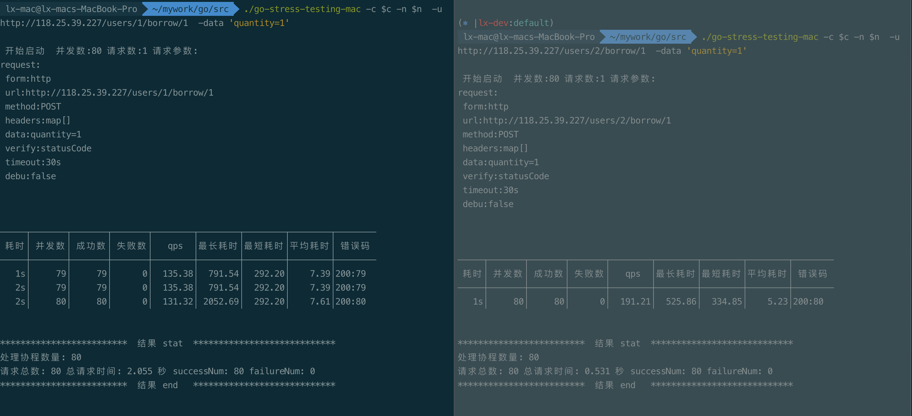

# README

### Ruby 版本
 2.5.1
### 项目介绍
* Rails 5.2.3
* redis_cache_store 使用 redis cluster 模式接入
* 消息中间件使用 sidekiq, 对应的 redis 使用 redis 单例, 使用 pool 优化。
* 使用 sidekiq status gem 配合完成消息 ack
* 使用 whenever 做定时更新
* 整个部署使用 puma + nginx + mina + passenger

### 项目思路
1. 搭建简单的图形界面，把基本功能写全，包括用户，书籍，交易流程等的增删改查
2. 不考虑并发的情况下完成借书和还书的逻辑
3. 补充并发逻辑, 实际实现方式如下：（完成购买，需要请求 2 个接口）

    ① POST /users/:id/borrow/:book_id 接口 完成消峰并投递任务至 sidekiq
    
    ② POST /transactions/ack 接口 进行确认成功购买的消息
    
    (注：由于开始的时候没有仔细看需求，这里和需求有点不一致，用户借书的时候扣款，还书不会有任何扣款)
4. 对一些汇总类型的消息，需要定时更新处理

   每隔 3 分钟，对高并发下不能及时完成处理的任务进行状态更新（相当于一个ack机制）
   
   每隔 5 分钟，对高并发下不能及时完成处理的任务进行用户退款
   
   每隔 10 分钟，对书籍的收入进行汇总
   
5. 重构代码（由于时间原因未实现，这里介绍下基本思路）
   
   ①将 redis 上锁等逻辑封装到一个 redis_helper 中
   
   ②梳理 controller 中的逻辑，并浓缩成几步（几个model方法）
   例如：
    
        borrow接口可以简化为: 1检查库存逻辑, 2创建消息逻辑, 3返回
        createTransactionJob 可以简化为: 1上锁, 2执行更新事务, 3解锁
        
        而具体逻辑可以在每一步的 model 逻辑中实现
        
6. 单元测试（时间原因，略）
7. 压力测试
    
    已经做了简单的压力测试, 结果如图：
    
    
    
    根据 UI 界面可知，用户的购买和书籍的库存数量会达到最终一致性。

### 接口介绍：

* 图形界面：
[用户接口](http://118.25.39.227/users "users")
[书籍](http://118.25.39.227/books "books")
[交易流水](http://118.25.39.227/transactions "transactions")
[消息队列](http://118.25.39.227/sidekiq "sidekiq")

* 非图形界面接口：

* POST /users/:user_id/borrow/:book_id

  explanation: 将借阅的情况传递给消息队列

  parameters: {quantity: 借书数量}
  
  response: {job_id: 消息队列job_id, borrow_time: 借书时间}

* POST /transactions/ack

  explanation: 上一步产生的消息队列，在这一步进行确认
  
  parameters: {user_id: 用户id, book_id: 书籍id, borrow_time, job_id}
  
  response: 成功即成功借到，否则返回失败原因
  
* POST /users/:user_id/restore/:book_id

  explanation: 还书(这里可能也会有超还的问题，处理思路和借书一样即可)
  
  parameters: {quantity: 还书数量}
  
  response: 成功或失败
  
* GET /books/:book_id/income
  
  explanation: 根据条件获取某个时间段某本书的总收入
  parameters: {start_at: 开始时间, end_at: 结束时间}

### 遇到的难点

* 有一段时间没使用 rest + rails, 稍微有点生疏
* 以前自己主导的销售类功能，并没有秒杀需求
* 部署时大多数用的以前的模板，发现存在不兼容问题，处理比较耗时
* 自己先简单看过，认为相对简单，所以周末没有一开始就做，而是应朋友很早的约定去他那里度过周末

### 实际总耗时

 * 12-15 小时
